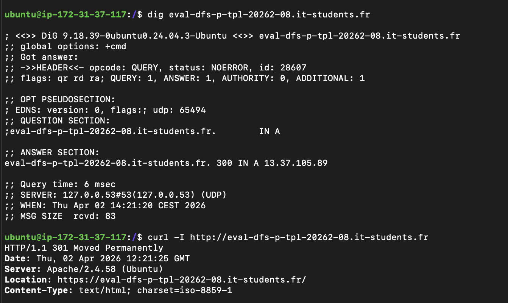
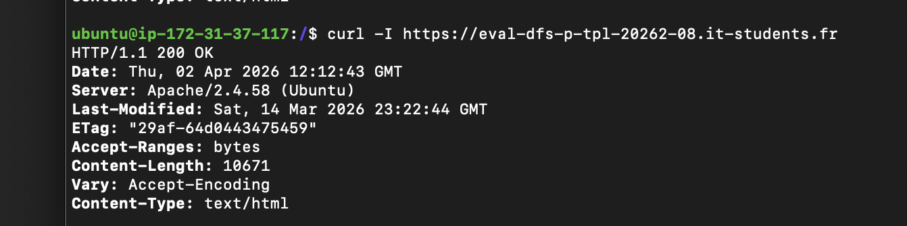

# Exploitation securisee de l'environnement de production

> Competences evaluees : `C28` — Administrer noms de domaines et certificats de securite, `C30` — Administrer des services d'hebergement en securite.

## 1. Mise en service de l'application

### 1.1 Services installes et configures

<!-- Lister les services mis en place sur la machine de production et leur configuration principale. -->

| Service | Version | Configuration notable |
| --- | --- | --- |
| Apache | 2.4.58 | Virtual host configuré sur le domaine public, proxy vers Next.js |
| PHP | 8.4.18 | CLI et module Apache |
| MySQL | 8.0.45 | Base opstrack créée, utilisateur user1 configuré sur localhost et 127.0.0.1 |
| MongoDB | - | Journalisation applicative sur port 27017 |
| Redis | - | Cache applicatif, authentification activée |
| Next.js | - | Microservice dispatch-dashboard sur port 3000 |
| Certbot | 2.9.0 | Certificat Let's Encrypt|

### 1.2 Procedure de mise en service

<!-- Decrire les etapes suivies pour rendre l'application fonctionnelle en production, dans l'ordre chronologique. -->

1. Connexion SSH sur le serveur de qualification
2. Correction des bugs identifiés sur la qualification
3. Export de la base MySQL depuis la qualification via mysqldump
4. Transfert du code via rsync depuis la qualification vers la production
5. Transfert du dump SQL via scp vers la production
6. Import de la base de données sur la production
7. Configuration du fichier .env production (APP_ENV, APP_DEBUG, APP_URL, mots de passe)
8. Configuration du virtual host Apache avec le domaine public
9. Installation et configuration du certificat TLS via Certbot
10. Vérification du bon fonctionnement via curl

## 2. Administration du domaine et DNS

### 2.1 Enregistrements DNS

<!-- Decrire les enregistrements DNS crees ou modifies. -->

| Type | Nom | Valeur | TTL |
| --- | --- | --- | --- |
| A | eval-dfs-p-tpl-20262-08.it-students.fr | 13.37.105.89 | 300 |

### 2.2 Preuves de resolution

<!-- Fournir une preuve de resolution DNS fonctionnelle (capture, commande dig/nslookup, etc.). -->

 
CAPTURE : 

## 3. Mise en service du HTTPS

### 3.1 Methode retenue

<!-- Decrire la methode utilisee pour obtenir et installer le certificat TLS (Let's Encrypt, certificat auto-signe, etc.). -->

Certificat TLS gratuit via Let's Encrypt, installé automatiquement par Certbot avec le plugin Apache.

### 3.2 Configuration du certificat

<!-- Decrire la configuration mise en place : redirection HTTP vers HTTPS, renouvellement automatique, etc. -->
 Redirection automatique HTTP vers HTTPS configurée par Certbot
- Renouvellement automatique via systemd timer (tous les 90 jours)
- Certificat déployé dans /etc/apache2/sites-available/000-default-le-ssl.conf

### 3.3 Preuve de fonctionnement

<!-- Fournir une preuve du HTTPS fonctionnel (capture, curl, navigateur, etc.). -->
ubuntu@ip-172-31-37-117:/$ curl -I https://eval-dfs-p-tpl-20262-08.it-students.fr
HTTP/1.1 200 OK
Date: Thu, 02 Apr 2026 12:09:20 GMT
Server: Apache/2.4.58 (Ubuntu)
Last-Modified: Sat, 14 Mar 2026 23:22:44 GMT
ETag: "29af-64d0443475459"
Accept-Ranges: bytes
Content-Length: 10671
Vary: Accept-Encoding
Content-Type: text/html

 

CAPTURE : 

## 4. Securisation de l'environnement

### 4.1 Gestion des acces et droits

- Accès SSH par clé privée uniquement (ubuntu.pem)
- Utilisateur ubuntu sans accès root direct
- Sudo requis pour les opérations système

### 4.2 Durcissement système et réseau

- APP_DEBUG=false et APP_ENV=production dans le fichier .env
- Mot de passe MySQL changé (trivial 0000 remplacé par mot de passe fort)
- Authentification Redis activée via requirepass
- MongoDB — authentification à configurer (point d'attention)

### 4.3 Gestion des secrets

- Secrets stockés dans le fichier .env non versionné
- Recommandation cible : migration vers AWS Secrets Manager

## 5. Configuration reproductible

**Déploiement du code**  
rsync -avz -e "ssh -i ubuntu.pem" ubuntu@QUAL_IP:/var/www/opstrack /var/www/

**Import base de données**  
mysqldump -u user1 -p'MOT_DE_PASSE' -h 127.0.0.1 opstrack > dump.sql
mysql -u user1 -p'MOT_DE_PASSE' -h 127.0.0.1 opstrack < dump.sql

**Migrations Laravel**  
php /var/www/opstrack/artisan migrate --force

**Certificat TLS**  
sudo apt install certbot python3-certbot-apache -y
sudo certbot --apache -d DOMAINE

**Vider le cache**  
php /var/www/opstrack/artisan config:clear
php /var/www/opstrack/artisan cache:clear

 
 

## 6. Points d'attention et limites connues

 
<!-- Documenter les limites identifiees et les points de vigilance pour la maintenance. -->

- MongoDB sans authentification — à sécuriser en priorité
- Renouvellement du certificat Let's Encrypt le 01/07/2026 (automatique via Certbot)
- Un seul serveur de production — pas de redondance (voir architecture cible livrable 01)
- Le fichier .env contient les secrets en clair — migration vers un gestionnaire de secrets recommandée géré par AW S